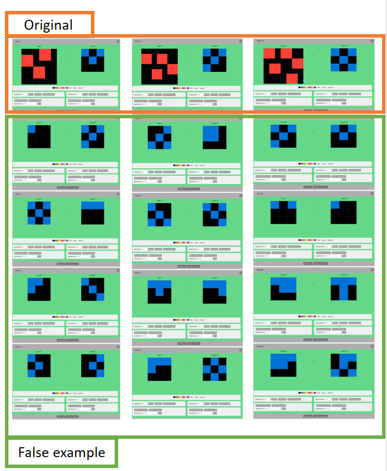

# Optional ARC (!!Work in Progress!!)

I'm creating a dataset based on the [Abstraction and Reasoning Challenge (ARC)](https://github.com/fchollet/ARC) in a multiple-choice format. !! However, it's still a work in progress!! Currently, only the training data has been created. I aim to have answer options for the evaluation data by the end of November. It's quite a challenging task, so any assistance is welcome. However, to avoid redundancy, please contact me if you're interested in helping.

In my view, ARC can be divided into the following three steps:

1. Recognizing objects within the grid (e.g., there's a 3x2 red block, a 10x1 blue line, yellow noise, etc.).
2. Deriving the relationships of the recognized attributes.
3. Generating the answer grid based on these relationships.

While the final answer in ARC was about generating the grid, step 3 is quite difficult. I felt that human-like abstract reasoning can be measured in steps 1 and 2, which is why I created this dataset. This idea is primarily based on introducing machine learning to tasks similar to raven's progressive matrices, like the [Procedurally Generated Matrices (PGM)](https://github.com/google-deepmind/abstract-reasoning-matrices) and [RAVEN](https://github.com/WellyZhang/RAVEN). My goal is to solve ARC using Deep Learning, and PGM and RAVEN seem to be well-researched in the Deep Learning community. (Reference paper: [Deep Learning Methods for Abstract Visual Reasoning: A Survey on Raven's Progressive Matrices](https://arxiv.org/abs/2201.12382))

# Directory Description
* train_original    
The original ARC data.

* train_expand   
Inside the test of the original ARC data, following the original input and output, there are four sets of input and output. These 2x4 grids are copies of the "test output." This was created to be edited with the ARC Editor when creating train_add.

* train_add   
Inside the test of the original ARC data, following the original input and output, there are four sets of input and output. These 2x4 grids serve as false answer options.

* train_add_10   
Mistakenly created with ten false answer options. There's potential for future use, but currently, it's not in use.

The evaluation will be structured similarly.

# Example
Below is an example from /training_add/ff28f65a.json.

While I'd like to provide a detailed explanation, it might be better for you to view the downloaded data in the [Arc Editor](https://arc-editor.lab42.global/editor).

# References

[1] https://github.com/fchollet/ARC  
[2] https://github.com/google-deepmind/abstract-reasoning-matrices  
[3] https://github.com/WellyZhang/RAVEN  
[4] https://arxiv.org/abs/2201.12382

*Note: This README.md has been machine-translated from JA_README.md.*